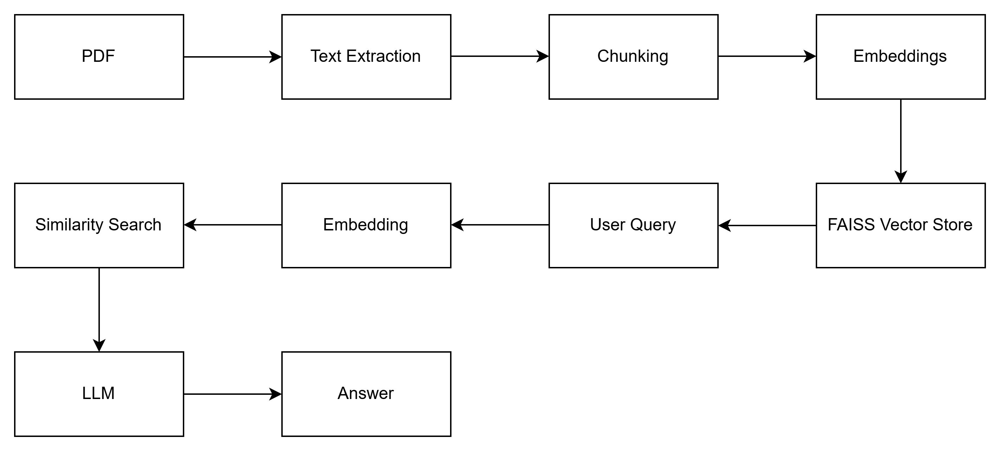

# AI Research Assistant

## Overview
This project is an AI-powered Research Assistant built using Python and FastAPI.
It ingests research PDFs, extracts and chunks text, generates vector embeddings, stores them in a FAISS vector database, and uses Retrieval-Augmented Generation (RAG) to answer questions, summarize documents, and generate structured literature reviews.

## Features
- PDF ingestion and text extraction
- Text chunking with overlap
- Semantic search using FAISS
- Question answering using RAG
- Document summarization
- Structured literature review generation
- REST API built with FastAPI

## Tech Stack
- Python
- FastAPI
- Sentence-Transformers
- FAISS
- PyMuPDF
- OpenAI API
- Uvicorn
## Architecture

The system uses Retrieval-Augmented Generation (RAG) to ensure answers are generated strictly from the ingested research documents.

## API Endpoints
- POST /ingest  
  Ingests a PDF and builds the vector index

- POST /query  
  Answers questions based on the ingested document

- POST /summary  
  Generates a high-level summary of the document

- POST /literature-review  
  Generates a structured academic literature review

## How to Run
1. Create a virtual environment
2. Install dependencies:
   pip install -r requirements.txt
3. Start the server:
   uvicorn src.api:app --reload
4. Open:
   http://127.0.0.1:8000/docs

## Testing
The API can be tested using:
- FastAPI Swagger UI (/docs)
- Postman: https://documenter.getpostman.com/view/22820614/2sBXVbFt8e

Endpoints accept JSON requests and return JSON responses.

## Future Improvements
- Support file uploads instead of file paths
- Add citation tracking
- Persist FAISS index to disk
- Support multiple documents
- Add frontend interface
- Add authentication